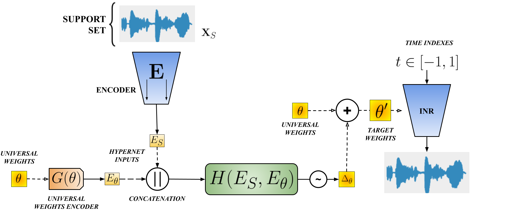

# FewSound
Code repository for: https://arxiv.org/abs/2503.02585

Repository based on https://github.com/WUT-AI/hypersound



## Abstract
Implicit neural representations (INR) have gained prominence for efficiently encoding multimedia data, 
yet their applications in audio signals remain limited. This study introduces the Kolmogorov-Arnold Network (KAN),
a novel architecture using learnable activation functions, as an effective INR model for audio representation. 
KAN demonstrates superior perceptual performance over previous INRs, achieving the lowest Log-Spectral Distance of 1.29 
and the highest Perceptual Evaluation of Speech Quality of 3.57 for 1.5 s audio. To extend KAN's utility, 
we propose FewSound, a hypernetwork-based architecture that enhances INR parameter updates. 
FewSound outperforms the state-of-the-art HyperSound, with a 33.3% improvement in MSE and 60.87% in SI-SNR. 
These results show KAN as a robust and adaptable audio representation with the potential for scalability 
and integration into various hypernetwork frameworks

## Setup

Setup conda environment:

```console
conda env create -f environment.yml
```
Set environmental variables in the environment, for example:

```console
conda env config vars set DATA_DIR=~/datasets
conda env config vars set RESULTS_DIR=~/results
conda env config vars set WANDB_ENTITY=my_wandb_entity
conda env config vars set WANDB_PROJECT=fewsound
```

Make sure that `pytorch-yard` is using the appropriate version (defined in `train.py`). If not, then correct package version with something like:

```console
pip install --force-reinstall pytorch-yard==2022.9.1
```

## Experiments

Default experiment:

```console
python train.py
```

Custom settings:

```console
python train.py cfg.learning_rate=0.01 cfg.pl.max_epochs=100
```

Isolated training of a target network on a single recording:

```console
python train_inr.py cfg.pl.max_epochs=100 cfg.inr_audio_path=PATH_TO_WAV
```
